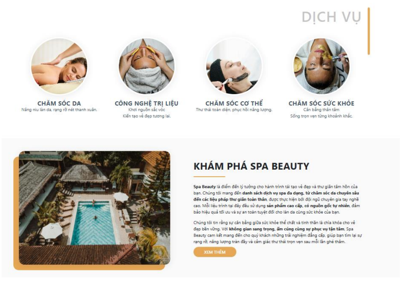
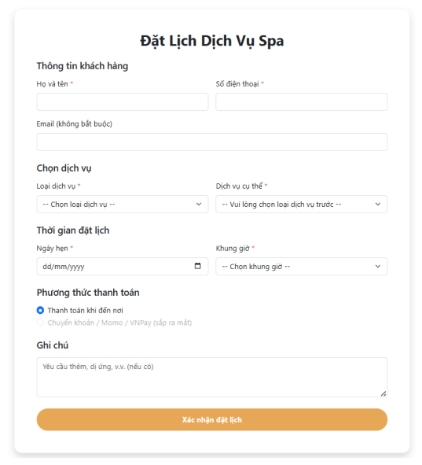
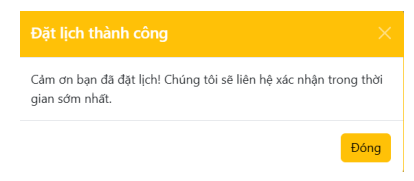
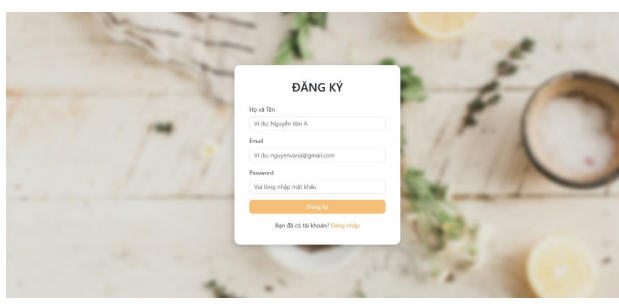
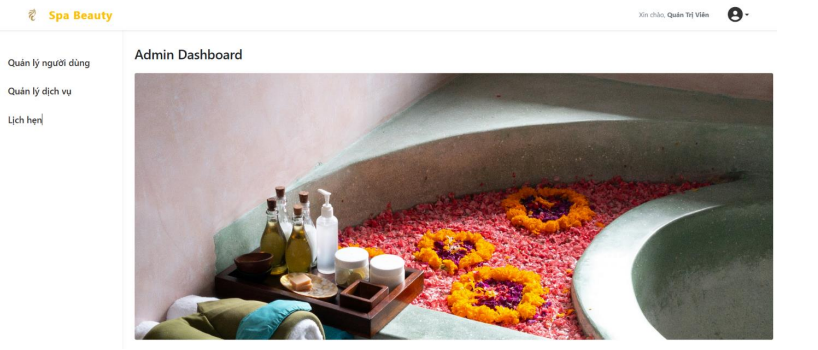
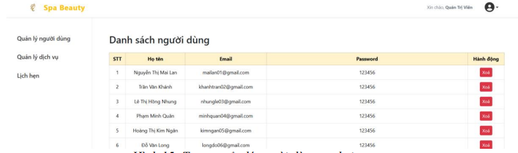
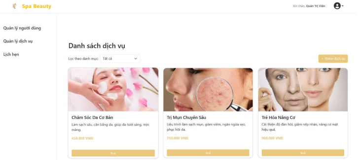

# 🌿 Spa Booking Website

> Hệ thống đặt lịch spa trực tuyến – Dự án môn Chuyền đề thực tế 2
---

## 📌 Giới thiệu

**Spa Booking Website** là một ứng dụng web cho phép khách hàng:

* Xem danh sách dịch vụ spa
* Đặt lịch trực tuyến
* Theo dõi lịch hẹn cá nhân

Đồng thời cung cấp cho **Admin**:

* Giao diện quản trị dịch vụ
* Quản lý lịch đặt
* Quản lý thông tin khách hàng

Dự án được xây dựng với mục tiêu mô phỏng quy trình triển khai một hệ thống đặt lịch thực tế, từ phân tích yêu cầu → thiết kế DB → triển khai tính năng → kiểm thử → báo cáo.

---
## 🎥 Demo & Hình ảnh dự án

### 1. Trang chủ

> Giao diện chính với hình nền spa sang trọng, tone vàng-trắng chủ đạo.

### 2. Danh sách & bộ lọc dịch vụ


> Hiển thị các gói dịch vụ kèm ảnh minh họa, giá tiền và nút đặt lịch nhanh.

### 3. Form đặt lịch


> Form đầy đủ thông tin, chọn dịch vụ – ngày giờ – phương thức thanh toán + modal xác nhận nhẹ nhàng.

### 4. Đăng ký & Đăng nhập


> Modal overlay trên nền hình spa thư giãn, rất bắt mắt và chuyên nghiệp.

### 5. Admin Dashboard



> Giao diện quản trị rõ ràng, dễ sử dụng.
> 
---
## 🏗️ Kiến trúc & cấu trúc dự án

```bash
spa-booking/
├── index.php               # Trang chủ
├── services.php            # Trang danh sách dịch vụ
├── about.php               # Giới thiệu spa
├── booking.php             # Trang form đặt lịch
├── booking_submit.php      # Xử lý submit đặt lịch
├── includes/               # Cấu hình DB, header, footer, hàm dùng chung
├── admin/                  # Khu vực quản trị (dịch vụ, lịch hẹn, tài khoản)
├── user/                   # Khu vực người dùng (profile, lịch sử đặt lịch)
├── assets/                 # CSS, JS, hình ảnh, fonts
├── spa_booking.sql         # File cấu trúc & dữ liệu database
└── noidungbaocao/          # word_baocao, slide_baocao, prompt, link_baocao, ...
```

---

## 🗄️ Cơ sở dữ liệu

Cơ sở dữ liệu `spa_booking.sql` (MySQL) bao gồm một số bảng chính:

* `users` – thông tin người dùng/khách hàng
* `admins` – tài khoản quản trị
* `services` – danh sách dịch vụ spa
* `bookings` – thông tin đặt lịch (ngày, giờ, dịch vụ, khách hàng, trạng thái)

Thiết kế DB theo hướng:

* Dễ mở rộng (thêm dịch vụ, thêm trạng thái, thêm loại tài khoản)
* Đảm bảo quan hệ rõ ràng (khoá chính/khoá ngoại, ràng buộc logic dữ liệu)

---

## ✨ Tính năng chính

### 👥 Phía người dùng (User)

* Đăng ký / đăng nhập tài khoản
* Xem danh sách dịch vụ spa
* Đặt lịch theo dịch vụ, ngày, giờ
* Theo dõi lịch hẹn cá nhân (nếu có triển khai phần quản lý lịch)

### 🛠️ Phía quản trị (Admin)

* Đăng nhập admin
* Quản lý dịch vụ: thêm / sửa / xoá
* Quản lý lịch đặt: duyệt, huỷ, cập nhật trạng thái
* Xem thông tin khách hàng và lịch sử đặt lịch

---

## 🧰 Công nghệ sử dụng

* **Ngôn ngữ:** PHP
* **Cơ sở dữ liệu:** MySQL
* **Frontend:** HTML, CSS, JavaScript, Bootstrap
* **Môi trường:** XAMPP / LAMP (Apache + MySQL + PHP)

---

## 🚀 Hướng dẫn cài đặt & chạy dự án

1. **Clone hoặc copy project:**

   ```bash
   git clone https://github.com/hoaikiet04/spa-booking.git
   ```

   Hoặc copy thư mục `spa-booking` vào:

   * `htdocs` (XAMPP)
   * hoặc thư mục gốc web server của bạn

2. **Tạo database & import:**

   * Tạo database, ví dụ: `spa_booking`
   * Import file `spa_booking.sql` vào MySQL (phpMyAdmin hoặc CLI)

3. **Cấu hình kết nối DB:**

   * Chỉnh sửa thông tin:

     ```php
     $host = 'localhost';
     $dbname = 'spa_booking';
     $username = 'root';
     $password = '';
     ```

4. **Chạy dự án:**

   * Mở trình duyệt và truy cập:

     ```text
     http://localhost/spa-booking
     ```

   * Khu vực admin (nếu có route riêng, ví dụ):

     ```text
     http://localhost/spa-booking/admin
     ```

---

## 🧪 Kiểm thử & quy trình phát triển

Trong quá trình phát triển, nhóm áp dụng quy trình tối giản:

1. **Phân tích & thiết kế**

   * Vẽ sơ đồ luồng đặt lịch
   * Thiết kế database (ERD, bảng, quan hệ)

2. **Phát triển tính năng**

   * Xây dựng giao diện public (trang chủ, dịch vụ, booking)
   * Xây dựng khu vực admin
   * Tích hợp logic booking, xử lý form, kết nối DB

3. **Kiểm thử (Testing)**

   * Kiểm thử thủ công các luồng chính:

     * Đăng ký/đăng nhập
     * Tạo booking
     * Duyệt/huỷ booking
   * Kiểm tra trường hợp lỗi: thiếu dữ liệu, sai định dạng, trùng lặp,…

4. **Hoàn thiện tài liệu & báo cáo**

   * Viết báo cáo (Word, PDF)
   * Chuẩn bị slide thuyết trình
   * Hoàn thiện README và hướng dẫn cài đặt

---
